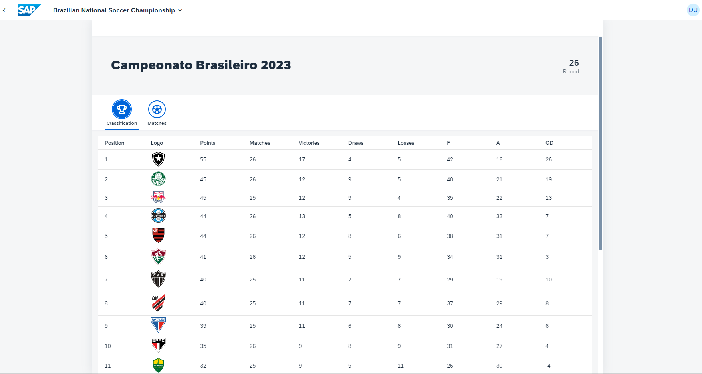
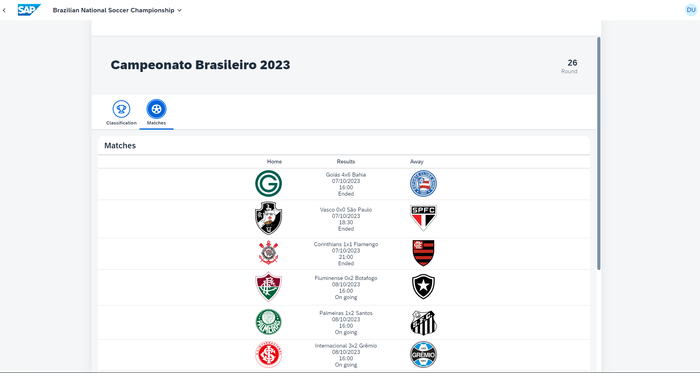

## Brasileirão 2023

This is my first ever SAPUI5 project. It is an application that get real-time data from a soccer [API](https://api-futebol.com.br/). It shows the classification table of the championship, the past and on going matches results and upcoming matches. The authorization API key used in the requests has been changed as the number of free requests is limited.

### Starting the application

-   This app has been generated using the SAP Fiori tools - App Generator, as part of the SAP Fiori tools suite.  In order to launch the generated app, simply run the following from the generated app root folder:

```
    npm start
```

### Application Screens

Image date/time --> 08/10/2023 - 17h35


