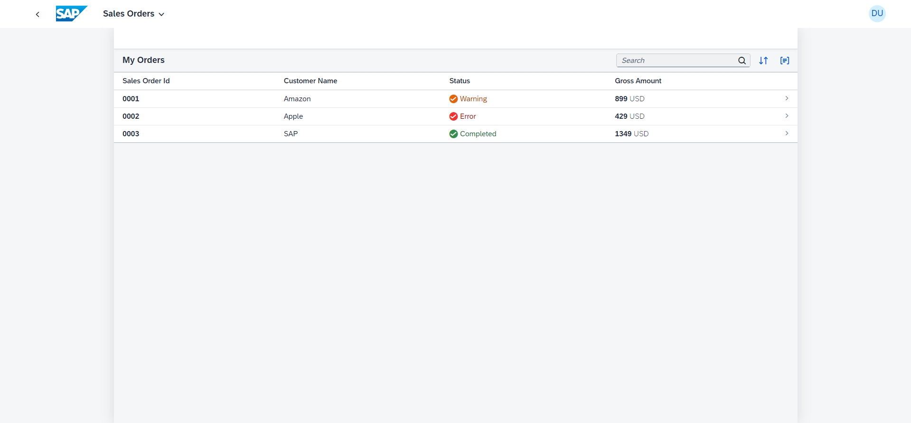

## Sales Order Application

### Topics covered
-   Basic controller controls (Homepage, Table, Aggregations)
-   MVC (Model - View - Controller) architecture
-   Data binding

### Starting the app

-   This app has been generated using the SAP Fiori tools - App Generator, as part of the SAP Fiori tools suite.  In order to launch the generated app, simply run the following from the generated app root folder:

```
    npm run start
```

#### Pre-requisites:

1. Active NodeJS LTS (Long Term Support) version and associated supported NPM version.  (See https://nodejs.org)

### Application Screen

